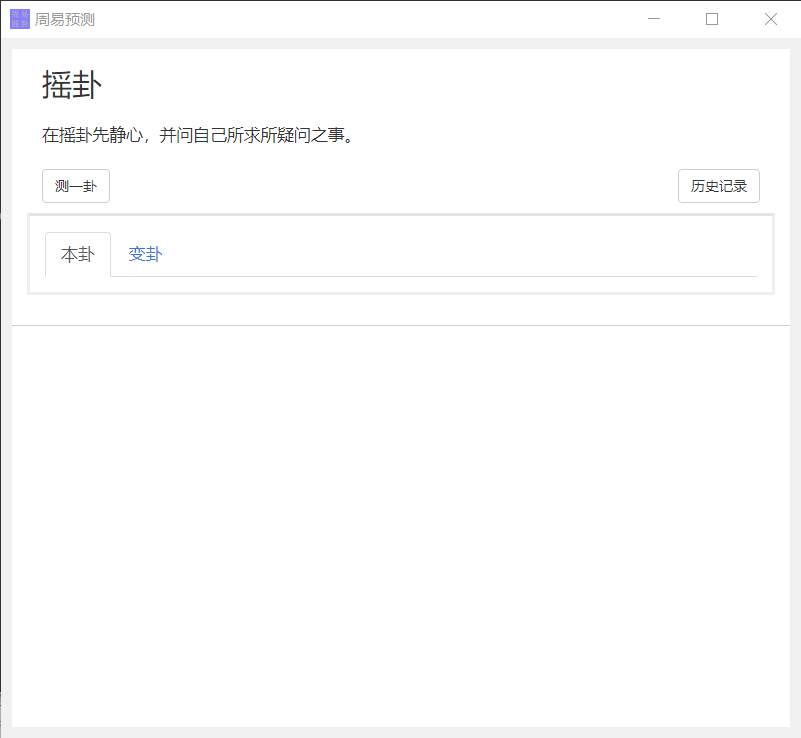

# yaogua
周易摇卦小程序，提供了命令行接口和桌面端应用。

## INSTALL
```
pip install yaogua
```

## USAGE
In command just input `yaogua` to yao yi gua.

Or you can input `yaogua_gui` to use the gui app. the gui showing below.

## gui


